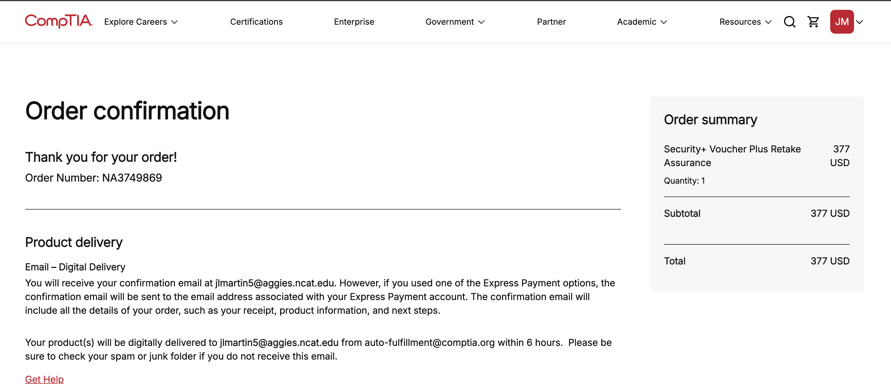
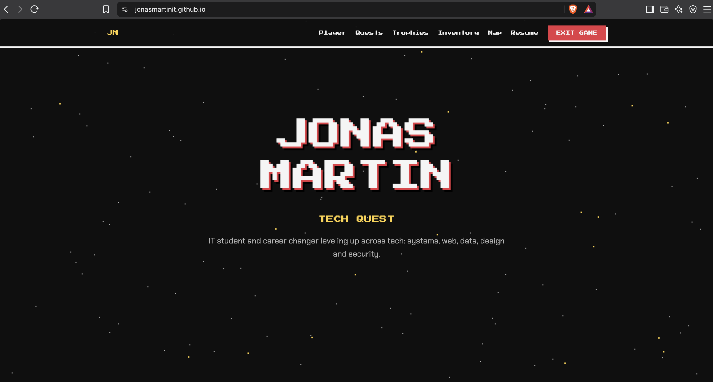

# Personal Portfolio Website

**Live site:** [jonasmartinit.github.io](https://jonasmartinit.github.io)
**Status:** Complete, updated as I finish new projects

<!-- To add screenshots: make a folder named "screenshots" in this repo, upload two images, then delete the arrows around the two lines below.

-->

## Overview

This is my personal portfolio site. I built it to give employers one link where they can see my projects, certifications, skills and work history. It also gives me a place to document what I'm working on as I finish my B.S. in Information Technology at NC A&T.

The site has two modes. The default is a clean, professional layout meant for recruiters and hiring managers. There's also a game mode that turns the whole site into a retro video game, with projects shown as quests and skills shown as an inventory. Both modes use the same content, so I only have to update things in one place.

## Goals

- Give employers a single link that shows my work, not just a list of skills
- Make the site easy to update as I add projects and certifications
- Practice HTML, CSS and JavaScript on something real
- Learn how to host and deploy a site with GitHub Pages

## Tools and environment

| Tool | What I used it for |
| --- | --- |
| HTML, CSS and JavaScript | The whole site, with no frameworks or site builders |
| GitHub | Storing the code and tracking changes |
| GitHub Pages | Free hosting for the live site |
| Google Fonts | Fonts for both modes |
| Claude (AI assistant) | Help drafting and revising the code and layout |

## Features

**Professional mode**
- Two-column layout with my profile on the left and my work on the right
- Projects can be filtered by Complete, In progress or Planned
- Each project expands to show milestones, skills used and a link to its write-up
- Skills are grouped by area, with what I use each tool for
- Works on phones, tablets and desktops

**Game mode**
- Switched on with the Game mode button in the top bar
- Black, gray, red, yellow and white retro theme with a moving starfield
- XP bar and player level that go up automatically as I finish project milestones
- Achievement pop-ups and a hidden Konami code easter egg

**Other details**
- Projects, certifications and skills are stored as simple lists in the JavaScript, and the page builds itself from them
- Animations turn off for visitors who have reduced motion turned on in their device settings
- Everything works with a keyboard, and buttons show a visible outline when selected

## How it's built

The whole site is one file, `index.html`, with the CSS and JavaScript inside it.

- **Two modes in one page.** Content that only belongs to one mode has a class of `p` (professional) or `g` (game). Clicking the toggle adds a `game` class to the page, and the CSS shows or hides content based on that class.
- **Content comes from lists.** Projects, certifications and skills live in three lists near the bottom of the file. JavaScript reads those lists and builds the project cards, certification cards and skill sections. To add a project, I add an entry to the list instead of writing new HTML.
- **XP is calculated, not typed in.** The game mode XP bar counts how many project milestones are marked done, so it stays accurate on its own.
- **Write-up buttons only show when there's a link.** If a project doesn't have a write-up yet, its button stays hidden instead of leading to a broken page.

## Design process

The site went through several versions before I landed on this one:

1. A plain portfolio with each project styled like a support ticket
2. A full retro video game site
3. A professional site with a hidden game mode toggle
4. A lab notebook design with graph paper and handwritten notes
5. A software release notes design where my career was told as version numbers
6. The final version: a clean, professional layout with the game mode kept as a toggle

The main thing I learned from this was to design for the audience. The creative versions were fun, but a recruiter only spends a short time on a portfolio. I kept the fun part as an option and made the default version easy to scan.

## Problems I ran into and how I fixed them

**GitHub showed my code instead of the website.**
Clicking `index.html` inside a repo always shows the source code. The live site is at a separate address. I turned on GitHub Pages under Settings, then Pages. I set it to deploy from the `main` branch and `/(root)` and used the address GitHub gave me.

**My changes weren't showing up on the live site.**
I had to make sure every edit was committed to the `main` branch, then check the Actions tab for a green check to confirm it deployed. After that, opening the site in a private window or doing a hard refresh (Ctrl+Shift+R) got past the old cached version in my browser.

**The site went down after I unpublished it.**
Unpublishing turns GitHub Pages off. I turned it back on by setting the source to deploy from `main` and `/(root)` again, then waited for the deploy to finish.

**The site gave a 404 error after I renamed the repo.**
My repo was originally named `jonasmartinit`, which made it a project site at `jonasmartinit.github.io/jonasmartinit`. Renaming it to `jonasmartinit.github.io` turned it into a user site at the shorter address, and the old link stopped working. I updated the link on my resume and on the site so they point to the new address.

**Write-up buttons led to pages that didn't exist.**
The project buttons pointed to repos I hadn't made yet. I changed the code so a button only appears once its project has a real link.

## What I learned

- How GitHub Pages deploys a site and how repo names decide the site address
- How to troubleshoot a site that isn't updating by working through the commit, the deploy and the browser cache in order
- How to use one set of content for two completely different designs
- How to keep a site easy to maintain by storing content in lists instead of repeating HTML
- That good design is about the person reading it, not just what looks cool

## How to update the site

- **Add a project:** copy one entry in the projects list in `index.html`, change the details and commit.
- **Finish a milestone:** change `done: false` to `done: true` for that milestone. The XP bar updates on its own.
- **Add a write-up:** paste the write-up's link between the quotes on that project's `link: ""` line.
- **Add a certification:** add a line to the certifications list. Once it's earned, change the status to `"earned"` and add the Credly link.
- **Update my resume:** upload the new PDF to this repo named `resume.pdf` so it replaces the old one.

## Next steps

- Add write-ups for my other projects, starting with the Active Directory homelab
- Add a custom domain
- Add screenshots of both modes to this write-up
